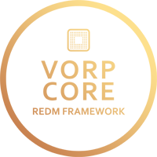

<Frame>
  
</Frame>

# VORP Core

**The lead Framework** for RedM to create **roleplay servers**,
offering you the tools you need to build your **custom server**.

---

<CardGroup cols={2}>
  <Card
    title="Join VORP Core Official Discord"
    icon="discord"
    color = "#7289da"
    href="https://discord.gg/JjNYMnDKMf">
    See updates share and learn with the community
  </Card>
  <Card
    title="Check GitHub"
    icon="github"
    color = "white"
    href="https://github.com/VORPCORE">
    The Official VORP Core Organisation
  </Card>
</CardGroup>

## Meet the developers

VORP Core is `actively maintained` by it's developers.

<CardGroup cols={4}>
  <Card
    color="lightgreen"
    title="Outsider"
    icon="code"
    href="https://github.com/outsider31000">
    Project Manager & Maintainer
  </Card>
  <Card
    title="Blue"
    icon="code"
    color="lightgreen"
    href="https://github.com/kamelzarandah">
   Project Lead
  </Card>
  <Card
    title="Black Pegasus"
    icon="code"
    color="lightgreen"
    href="https://github.com/creativewild">
    Experienced Developer
  </Card>
  <Card
    title="James the Coding Gamer"
    icon="code"
    color="lightgreen"
    href="https://github.com/James-the-Coding-Gamer">
    Assistant
  </Card>
  <Card
    title="Z-eus"
    icon="code"
    color="lightgreen"
    href="https://github.com/Z-eus">
    Assistant
  </Card>
</CardGroup>

## Meet the staff

VORP Core is `actively supported` by the support team and community

<CardGroup cols={4} >
  <Card
    title="Hobbs"
    icon="shield"
    color="lightgreen"
    href="https://github.com/DerHobbs"
    >
    Discord Staff
  </Card>
  <Card
    title="Unknownsoph"
    icon="shield"
    color="lightgreen"
    href="">
    Discord Staff
  </Card>

</CardGroup>